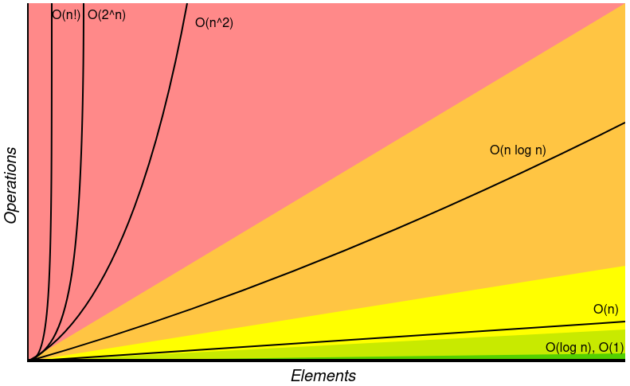

# Time complexity

Time complexity is a concept to describe how much time an [algorithm](dsa_algorithms/dsa_algorithms.md) will take to complete based on the size of the input. It's an important concept needed to be able to write efficient code or to optimize existing code. 

## Measuring efficiency

The first step to understanding time complexity and writing more efficient code is to understand how to measure it. Looking at a simple example that prints all the even numbers from 1 to 10:

```js
function printOddNumbers() {
	let num = 1;

	while (num < 10) {
		if (num % 2 !== 0) {
			console.log(num);
		}

		num += 1;
	}
}
```

The efficiency of this simple algorithm can be measured by evaluating how many *steps* are required for it to complete. An algorithm that only takes 5 steps will always be faster than one that takes 20 steps. 

The above example can be measured as follows:

1. The number 1 is assigned to the variable `num`. 1 step.
2. The `while` loop will execute the following steps in each iteration:
	1. Compare if `num` is less than 10. 1 step.
	2. Check if `num` is an even or odd number. 1 step.
	3. If it's odd, print it to the console. 1 step every 2 iterations.
	4. Increase `num` by 1. 1 step.
3. Check the exit condition of the loop again to see if `num` is still less than 10. 1 step.

There are 3 steps for each loop iteration, the loop will iterate 9 times, so that makes 27 steps. One step inside the loop will iterate only half of the loop iterations, an additional 5 steps. Assigning the variable at the start and checking the exit condition of the loop are one step each. Adding these up evaluates to $27 + 5 + 1 + 1 = 34$ steps.

This algorithm will always take 34 steps to execute, but that info alone is not very useful for comparing the efficiency of algorithms. The next example is slightly modified to print up to a specified number instead of a hardcoded value.

```js
function printOddNumbers(max) {
	let num = 1;

	while (num < max) {
		if (num % 2 !== 0) {
			console.log(num);
		}

		num += 1;
	}
}
```

In this example, the number of steps will depend on the input, and it will increase with higher input values. Because the number of steps changes based on the external input, there is no concrete number to measure the efficiency.

Instead, it is important to measure how this number will scale when the size of the input data increases. This can be done using **asymptotic notations**, in particular **Big O**.

## Asymptotic notations

Asymptotic notations are used to describe the running time of an algorithm. Because this running time can differ depending on the input, there are several different notations that measure the running time in different ways. The 3 most common ones are:

- Big O Notation - represents the upper bound of an algorithm, also known as the worst case.
- Omega Notation - represents the lower bound of an algorithm, also known as the best case.
- Theta Notation - represents both the lower and upper bounds of an algorithm, also known as the average.

The Big O Notation is the most commonly used one of these three, because it is important to know how an algorithm will scale in the worst case scenario to ensure its scalability.

## Big O Notation

Big O provides a consistent way to measure the time efficiency of an algorithm. It gives a measurement of the time an algorithm takes to run as the input grows. This allows to directly compare the performance of different algorithms and pick the best one.

The Big O Notations in order of speed from fastest to lowest are:

- $O(1)$ - Constant complexity
- $O(log N)$ - Logarithmic complexity
- $O(N)$ - Linear complexity
- $O(N \cdot logN)$ complexity
- $O(N^2)$ - Quadratic complexity
- $O(2^N)$ - Exponential complexity
- $O(N!)$ - Factorial complexity

These same notations also apply to Omega and Theta Notation.

This graph displays how each of these complexities scale.



### Constant complexity

Constant complexity simply means that an algorithm will always take the same amount of time, independent of the input data size. The simplest way to represent this is accessing an item in an [array](../dsa_data_structures/dsa_array.md).

```js
const arr = [1, 2, 3, 4, 5, 6];

console.log(arr[2])
```

No matter how big the array is, accessing the item will always take the same amount of time.

### Logarithmic complexity

The execution time of the algorithm grows logarithmically as the input size increases. This means that the number of steps will increase by 1 every time the input size doubles.

A simple overview of this can be seen in this table:

| Size | Steps |
| ---- | ----- |
| 1    | 1     |
| 2    | 2     |
| 4    | 3     |
| 8    | 4     |
| 16   | 5     |
| 32   | 6     |
| ...  | ...   |

### Linear complexity

The execution time of the algorithm and the size of the input will increase at the same rate. The algorithm will scale linearly. The simplest example for this is iterating over each element of an array.

```js
const arr = [1, 2, 3, 4, 5];

arr.forEach((item) => {
	// ...
});
```

As the size of the array increases, additional iterations need to be done for each new element.

### N x log N - complexity

This inconveniently named complexity is a combination of logarithmic and linear complexity. Such an algorithm commonly consists of two parts. The first part is an algorithm with logarithmic complexity, breaking down the problem into smaller sub-problems of the same type. The second part is an algorithm that is actually used to solve the problem, commonly of linear complexity.

A common example for this is the [merge sort](dsa_algorithms/dsa_sorting/dsa_merge_sort.md) algorithm.

### Quadratic complexity

The execution time of algorithms with quadratic complexity scales quadratically with the size of the input. The easiest way to think about this is using nested loops to iterate over a dataset multiple times.

```js
const arr = [1, 2, 3, 4, 5];

for (let i = 0; i < arr.length; i++) {
	for (let j = 0; j < arr.length; j++) {
		// ...
	}
}
```

In this example, the array has 5 items. The outer loop would iterate 5 times, once for each item in the array. The inner loop would also iterate for a total of 5 times, for each time iteration of the outer loop. This would add up to a total of 25 steps. Adding one single item to the array would increase the running time to 36 steps.

### Exponential complexity

Exponential complexity is the inverse of logarithmic complexity. The execution time grows exponentially with the input size, doubling for each additional input item.

This can be seen in this table:

| Size | Steps |
| ---- | ----- |
| 1    | 2     |
| 2    | 4     |
| 3    | 8     |
| 4    | 16    |
| 5    | 32    |
| ...  | ...   |

### Factorial complexity

The factorial is the product of number sequence up to `n`. For example, $4!$ would be $4 \cdot 3 \cdot 2 \cdot 1 = 24$.

This is by far the worst scaling option, since the execution time is the factorial value of the input size:

- An input size of 5: $5! = 120$ steps
- An input size of 6: $6! = 720$ steps

## Omega Notation

As stated above, Big O Notation looks at the worst case scenario, meaning it searches for the longest possible running time as input size grows.

Omega Notation on the other hand looks for the best case scenario, the smallest amount of time required with bigger input sizes.

```js
function findValue(arr) {
	for (let i = 0; i < arr.length; i++) {
		if (arr[i] === 1) {
			return arr[i];
		}
	}
}
```

In the above example, the worst case scenario would be if the searched value was the last item in the array, or not in the array at all. Since the amount of steps in this case would grow linearly with the array size, this is a `O(N)` complexity.

In the best case, the value would always be the first item in the array, so the algorithm would finish in the first loop iteration independently of the array size. This results in `O(1)` complexity.

## Theta Notation

While Omega searches for the best case and Big O searches for the worst case, Theta tries to give a range between these upper and lower bounds.

For an algorithm that loops over an array and performs an action on each item, it will always run in `O(N)` in both worst and best case. This will also be the Theta performance of the algorithm.