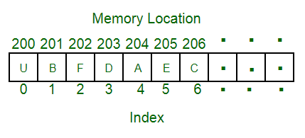

# Arrays

An array is a fundamental [data structure](dsa_data_structures.md) that stores a fixed-size sequence of elements of the same type. It is one of the simplest and most fundamental data structures, most programming languages have arrays implemented in some way.

Most static programming languages implement arrays to store only a single data type and to have a fixed, predefined size. Dynamic programming languages often allow arrays to store multiple different data types at the same time and to grow dynamically.

Arrays store data through indexing. Each piece of data stored inside an array receives an index, which allows to access it.

Elements of an array are stored in contiguous memory locations, meaning that each element is placed directly adjacent in memory.

When creating an array, the value actually stored in the variable is a pointer to the first element of the array in memory. The indexes are simply an offset that will be added to this pointer.

Arrays are pretty simple, yet quite efficient data structures. Accessing an element inside an array is very fast, with a [time complexity](../dsa_algorithms/dsa_time_complexity.md) of $O(1)$. This can be achieved, because the memory address of any element can be computed directly using its index. 