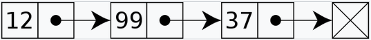
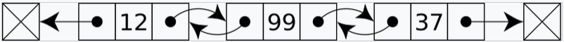
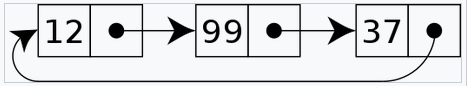

# Linked lists

A linked list is a linear [data structure](dsa_data_structures.md) similar to an [array](dsa_array.md). The main difference between a linked list and an array is that the order of the elements is not determined by their physical placement in memory.

A linked list consists of several nodes. Each node stores the data itself and a pointer to the next node. This structure allows for dynamic insertion and deletion of nodes at any position inside the list without needing to reallocate or reorganize the entire structure because the individual elements don't have to be placed directly next to each other in memory. It also removes the problem of the fixed size of arrays.



However, simple linked lists don't allow random access to a specific node or any form of indexing. Because of this, simple operations like accessing a specific node or inserting a new node somewhere in the list may require iterating through most or all of the structure.

## Implementation

Linked lists are commonly implemented using two structures:

- **Nodes** are used to store the data itself as well as pointers to each other.
- The **list** itself, which stores the individual nodes and provides different methods to manipulate the list.

### Nodes

Nodes are quite simple data structures. They only have to hold the data and a pointer and commonly don't need to provide methods for data manipulation.

A simple node structure can be implemented with the following [pseudocode](../../../basics/pseudocode.md):

```
class Node:
	constructor(value):
		this.data = value
		this.next = null
```

### Lists

A separate **list** structure is commonly used to store nodes and to manipulate them. This structure handles the relationship between nodes and provides different methods for insertion, deletion and manipulation of nodes.

Such a list structure can be implemented with the following pseudocode:

```
class LinkedList:
	constructor():
		this.head = null

	function append(value):
		node = new Node(value)

		if this.head is null:
			this.head = node
		else:
			current = this.head
			while current.next is not null:
				current = current.next

			current.next = node

	function prepend(value):
		node = new Node(value)

		if this.head exists:
			node.next = this.head

		this.head = current
```

This simple implementation provides methods to add new nodes to both the start (head) and the end (tail) of the list.

## Types of linked lists

There are many different ways to implement how the nodes of a linked list reference each other. Commonly, a node simply contains a field that will contain the address of the next node, usually called *next link* or *next pointer*. All other fields of the node are used to store data.

A list has a **head**, which is the first node in the list. The head will be the entry point to access the list. It can - but doesn't have to - have a direct reference to the **tail**, which is the last node of the list.

A node is not restricted to point only to the next node in the list. There are quite a few options for implementation:

- **Singly linked lists** are the simplest ones already described above. Each node only holds the pointer to the next node in the list.


- In a **doubly linked list**, each node contains not only the pointer to the next node, but also to the previous one. This allows to iterate through the list in both directions.



- In common linked lists, the tail node will point to *null* to indicate the end of the list. However, in a **circular linked list** the tail node will point back to the head of the list.

