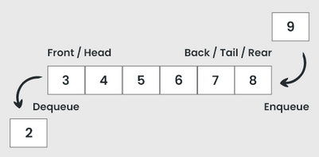

# Queues

A queue is a fundamental linear [data structure](dsa_data_structures.md) used for managing and storing data in a specific order. It follows the First-In-First-Out (FIFO) principle, meaning that the first element added to the queue will be the first one to be removed. In other words, new items can only be added to the end of the queue and items can only be removed from the start of it.



## Basic operations

There are many different operations that can possibly be implemented in a queue. Some of the most fundamental ones are:

- **Enqueue (Insert)** - adding new items to the end of the queue.
- **Dequeue (Remove/Delete)** - removing (and returning) the first item from the queue.
- **Peek** - returning the current first item in the queue without removing it.
- **Empty** - checking if the queue is empty
- **Full** - if the queue has a size limit, checking if it is full.

## Implementation

A queue can be implemented using either an [array](dsa_array.md) or a [linked list](dsa_linked_lists.md) to store the data. The queue data structure can be seen as an [abstraction](../../../basics/abstraction.md) on top of one of these structures, so insertion is only allowed at the end (rear) and extraction only at the start (front).

A simple implementation of a queue using a linked list can be achieved with the following [pseudocode](../../../basics/pseudocode.md):

```
class Queue:
	constructor(length):
		this.queue = new LinkedList()
		this.length = length
		this.size = 0

	function enqueue(value):
		if this.isFull():
			throw new Error("Queue is full")
		else:
			this.queue.append(value)
			this.size += 1

	function dequeue():
		if this.isEmpty():
			throw new Error("Queue is empty")
		else:
			this.size -= 1
			return this.queue.removeFirst()

	function isFull():
		return this.size >= this.length

	function isEmpty():
		return this.size == 0
```

## Applications

Queues are a fundamental data structure used in many areas of computer science and programming. Some common use cases are:

- Task scheduling and event handling
- Data transfer in network communication
- Simulation of real-world systems