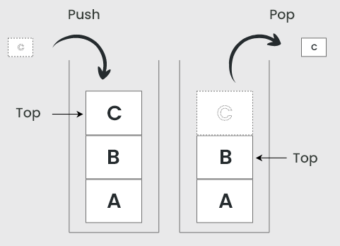

# Stacks

A stack is a basic linear [data structure](dsa_data_structures.md) that works similar to a [queue](dsa_queue.md). It follows the Last-In-First-Out (LIFO) principle, meaning that the last element added to the stack will be the first to be removed.

A stack structure can be compared to a real-world stack of items, where the last item added to the top of the stack has to be the first to be removed to access other items.



## Basic operations

Similar to a queue there are some fundamental operations that can be implemented in a stack:

- **Push** - adding a new item to the top of the stack
- **Pop** - removing the top item from the stack
- **Peek** - returning the current top item of the stack without removing it
- **Empty** - checking if the stack is empty
- **Full** - if the stack has a limit, checking if it is full

## Implementation

Similar to a queue, a stack can be implemented using either an [array](dsa_array.md) or a [linked list](dsa_linked_lists.md). It can be seen as an [abstraction](../../../basics/abstraction.md) on top of one of these structures which allows insertion and extraction only from the end (rear).

A simple implementation of a stack can be achieved using the following [pseudocode](../../../basics/pseudocode.md):

```
class Stack:
	constructor(limit):
		this.stack = []
		this.limit = limit
		this.size = 0

	function push(value):
		if this.isFull():
			throw new Error("Stack is full")
		else:
			this.stack.append(value)
			this.size += 1

	function pop():
		if this.isEmpty():
			throw new Error("Stack is empty")
		else:
			this.size -= 1
			return this.stack.pop()

	function isFull():
		return this.size >= this.limit

	function isEmpty():
		return this.size == 0
```