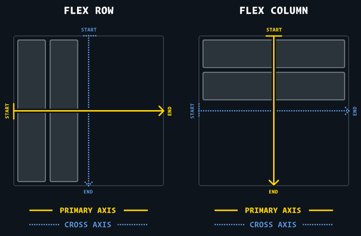
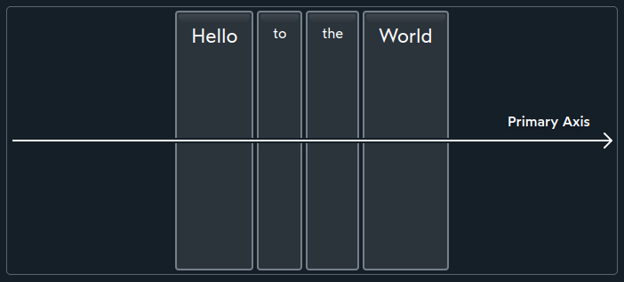
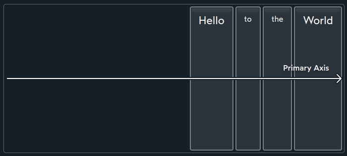
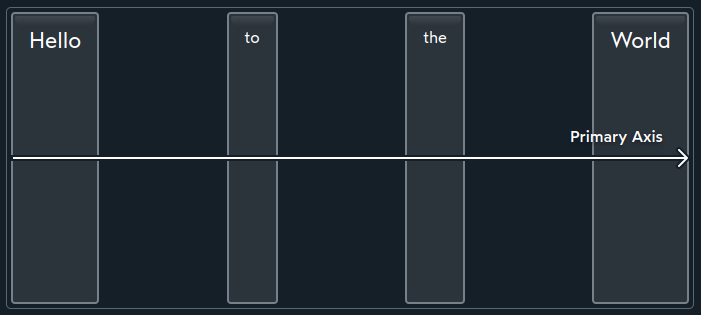
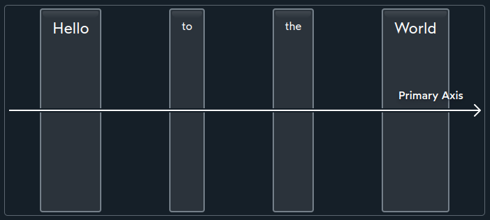
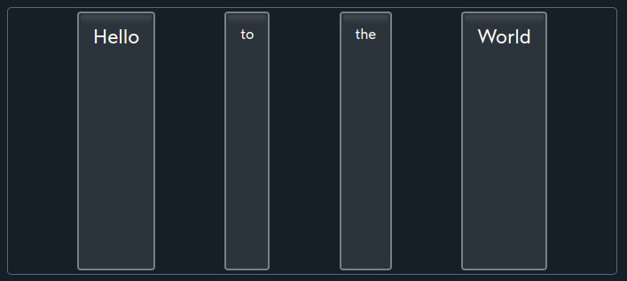
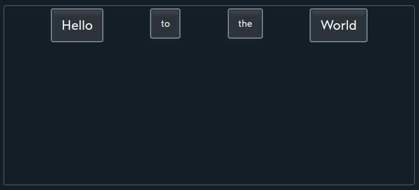
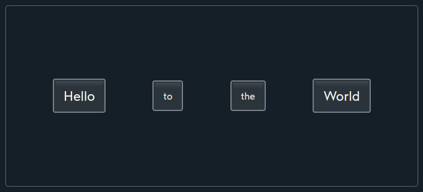
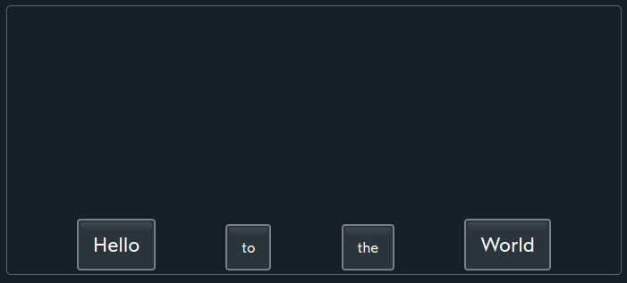
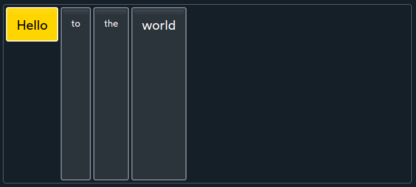

# Flexbox

Flexbox is a [CSS](css.md) layout model, which makes it easier to create more complex and responsive layouts in web applications. It allows to turn any [HTML element](../html/html_elements_tags.md) into a so called "Flex Container".

## Flex container

Every HTML element can be turned into a Flex container by setting its `display` property to `flex`:

```css
div.container {
	display: flex;
}
```

## Flex axes

Flex containers have two axes: the **main axis** and the **cross axis**. By default, the main axis is aligned horizontally and the cross axis vertically. All items within the Flex container will be aligned on the main axis and all flex rules are based on it.

This alignment can be changed with the `flex-direction` property:

```css
div.container {
	display: flex;
	flex-direction: column;
}
```

By doing this, the main axis is aligned vertically and the cross axis horizontally.



All children will be positioned on these two axes according to two simple rules:

1. Main axis: Children will be bunched up at the start of the axis
2. Cross axis: Children will stretch out to fill the entire container.

## Alignment - main axis

The main axis is all about the distribution of the group, it's not used to align a single item.

The `justify-content` property can be used to change the alignment of the flex items across the main axis. This property can have the following values:

- `flex-start`: All items are grouped together at the start of the container. This is the default value.


- `center`: All items are grouped together in the center of the container.



- `flex-end`: All items are grouped together at the end of the container.



- `space-between`: Items are spread across the main axis with even spacing between each item. There is no spacing at the borders of the container.



- `space-around`: The space around each item is distributed evenly, each item has the same space around it. The space before the first item and after the last item is half the space between items.



- `space-evenly`: Creates equal space between the items, as well as between the container edges and the outermost items.


## Alignment - cross axis

As opposed to the main axis, the cross axis is used to align individual items. This can be achieved by using the `align-items` property. It can have the following values:

- `stretch`: The items stretch to fill out the entire cross axis. This is the default value.



- `flex-start`: The items are aligned at the start of the cross axis.



- `center`: The items are aligned in the center of the cross axis.



- `flex-end`: The items are aligned at the end of the cross axis.



- `baseline`: The items are aligned across the baseline, which is the first line of text inside the items. This can be useful to align multiple different font sizes.


## Alignment - container and items

The `justify-content` property tells the container how to position the items on the main axis. Because the items share the same main axis, it isn't possible to position each item individually.

The `align-items` property tells the container how to position the items on the cross axis. In contrast to the main axis, each item can be thought of having its own cross axis which runs in a right angle to the main axis.

Because of this, each item can also be aligned individually across the cross axis by using the `align-self` property with the same values that are available for `align-items`:

```css
div.container {
	display: flex;
	justify-content: flex-start; /* default value */
	align-items: stretch; /* default value */
}

div#first-item {
	align-self: flex-start;
}
```



## Wrapping

Setting the `flex-wrap` property to `wrap` allows the items to wrap to a new line when the content of the container would otherwise overflow. This is an easy way to implement a responsive design

## Growing and shrinking

Flexbox has three properties which control how the items grow and shrink in relation to each other. These properties are set on each individual item inside the container:

- `flex-grow`: Takes a single number as its value. This property defines how "fast" an item grows in relation to the other items. An item with `flex-grow: 2;` set will take up twice as much space as an item with `flex-grow: 1;`.
- `flex-shrink`: This property similar to `flex-grow`, but it defines how fast an item will shrink in comparison to the others when the container shrinks.
- `flex-basis`: This property defines the base size of the item. `flex-grow` and `flex-shrink` will use this value as baseline for growing and shrinking. By default, setting this value will overwrite any defined `width`. Setting `flex-basis: auto;` will tell the item to use any width declaration for this value.

These three properties can be set all at once using the `flex` shorthand:

```css
/* These two  */

div#item1 {
	flex-grow: 1;
	flex-shrink: 1;
	flex-basis: auto;
}

div#item2 {
	flex: 1 1 auto;
}
```