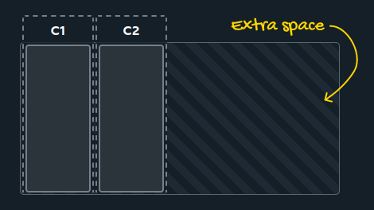
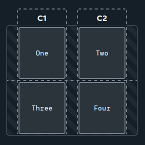
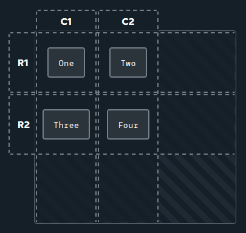
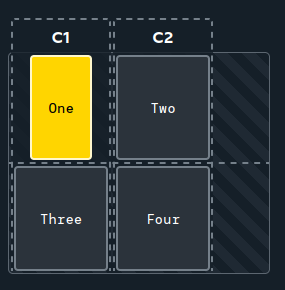

# Grid item alignment

[CSS Grid](css_grid.md), similar to [Flexbox](../css_flexbox.md), allows to define how the items inside the container should be aligned. Grid even uses similar property names as Flexbox for these actions.

## Track alignment

If the defined grid tracks don't take up all the available space of the container, there will be plenty of extra space left. Similar to Flexbox, it is possible to define how the tracks should be aligned in regard to this extra space.



Columns can be aligned using the `justify-content` property.

```css
.container {
	display: grid;
	grid-template-columns: 100px 100px;
	justify-content: space-evenly;
}
```



Similarly, rows can be aligned using the `align-content` property.

```css
.container {
	display: grid;
	grid-template-columns: 100px 100px;
	grid-template-rows: 100px 100px;
	justify-content: center;
	align-content: center;
}
```

Both the `justify-content` and `align-content` properties can have the same values:

- `start`
- `center`
- `end`
- `space-between`
- `space-around`
- `space-evenly`

They all work similar to the values of `justify-content` in Flexbox.

Instead of using these two properties, it is also possible to use the `place-content` shorthand. This shorthand can take in up to two values. The first value will be applied to `justify-content`, the second to `align-content`.

## Cell alignment

Grid also allows to define, how the content inside the cells should be aligned. This can be achieved using the `justify-items` and `align-items` properties, or the `place-items` shorthand.

These properties can have the following values, which work similar to the values of `align-items` in Flexbox:

- `stretch`
- `start`
- `center`
- `end`

```css
.container {
	display: grid;
	grid-template-columns: 100px 100px;
	grid-template-rows: 100px 100px;
	justify-items: center;
	align-items: center;
}
```



`justify-items` is used to align the cell content horizontally, `align-items` is used to align it vertically.

These properties can also be applied to each cell individually by using the `justify-self` and `align-self` properties or the `place-self` shorthand.

```css
.container {
	display: grid;
	grid-template-columns: 100px 100px;
}

.cell-one {
	justify-self: center;
}
```

