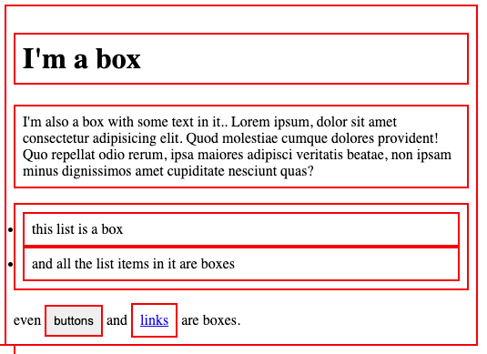

# The Box Model

The box model is a very important concept to understand positioning and layout in [CSS](css.md). Basically, every element on a web page is a rectangular box. Boxes can contain other boxes and can sit alongside other boxes. 



There are different ways to manipulate the size of the boxes, as well as the space between them, by using `padding`, `margin` and `border`:

- `padding` increases the space between the borders of the box and its content
- `margin` increases the space between the borders of one box and the borders of the adjacent boxes
- `border` adds space between the padding and the margin

## Box sizing

The `box-sizing` property defines how padding, margin and border behave when defining the width and the height of an element. It can have two values:

### Content box

```css
p {
	box-sizing: content-box;
	width: 100px;
	height: 30px;
	padding: 10px;
	border: 5px;
	margin: 10px;
}
```

The defined width and height will only apply to the content of the `<p>` element. The padding, border, and margin will be added to the defined width and height to receive the total values (the effective width and height of the box):

- Width: $100px + 10px + 5px + 10px = 125px$
- Height: $30px + 10px + 5px + 10px = 55px$

### Border box

```css
p {
	box-sizing: border-box;
	width: 100px;
	height: 30px;
	padding: 10px;
	border: 5px;
	margin: 10px;
}
```

The total width and height of the box correspond to the defined values and padding, margin and border will shrink the width and height of the content.